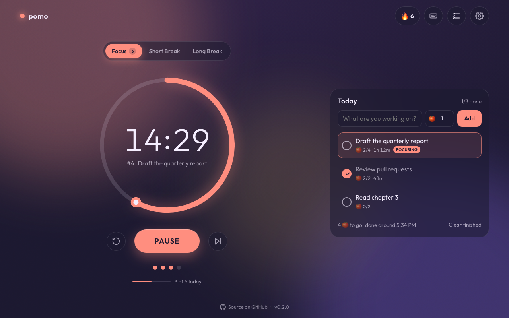
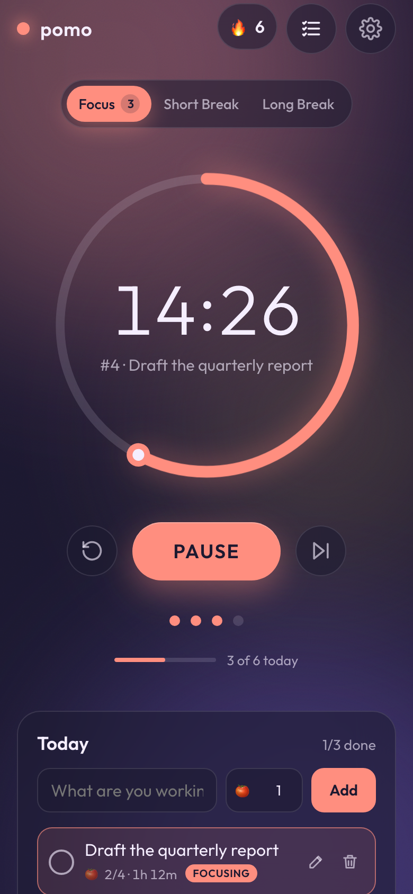

# 🍅 pomo

An aesthetic, customizable Pomodoro timer with smooth [anime.js](https://animejs.com) motion. It has tasks, streaks, stats and keyboard shortcuts, and everything stays in your browser.

**[Open the app →](https://parmsam.github.io/pomotimer2/)**

<p align="center">
  
  &nbsp;
  
</p>

## Features

- **A timer that doesn't drift.** It counts from a saved end time, so background tabs, sleep and reloads don't throw it off. A session that finishes while the page is closed still counts.
- **Tasks.** A "Today" list with pomodoro estimates, an estimated finish time, and focus time tracked against whichever task you're working on.
- **Markdown in and out.** Paste a Markdown checklist to add many tasks at once (`- [ ] Write report 🍅3`). Copy your tasks or today's log as Markdown, or download a session log for any period.
- **Honest sessions.** Following [Cirillo's rule](https://en.wikipedia.org/wiki/Pomodoro_Technique#Description) that a pomodoro is indivisible, stopping early abandons it, but your focused minutes still count toward today. Past the halfway mark you can still count it.
- **Progress.** A daily streak, a daily goal, per-mode counts, and a 7-day focus chart.
- **Optional extras:** strict mode (no pausing), interruption tracking (internal/external, with notes saved for later), and focus mode, which hides everything but the timer.
- **Clock faces.** The classic ring, a **tomato** kitchen timer, a **Tamagotchi** whose pixel pet grows as you complete pomodoros, an **hourglass**, a **plant buddy** that grows and blooms through a session, a **robot pet**, a **retro handheld**, a **potion flask** that brews during focus, **Tetris**, a squishy **blob pet**, a **spaceship** orbiting a planet, or a **hamster wheel**. The pop-out mini timer shows the same face.
- **Living backgrounds.** Soft CSS color blobs, or three.js scenes (fireflies, aurora, rain) that follow your theme, calm down on breaks and pulse when a session ends. three.js only loads if you pick one.
- **Quotes (optional).** A quote under the timer, a new one each session: 100 well-sourced lines from scientists, philosophers and writers (kept in [`src/content/quotes.md`](src/content/quotes.md)), or your own.
- **Make it yours.** Five themes, per-mode colors, interval presets (25/5/15 · 50/10/20 · 90/15/30), alarm sounds, and an optional tick.
- **Stays with you.** A pop-out mini timer that floats above other windows (Chrome/Edge), a full-screen button, progress in the tab icon, and the screen stays awake while a session runs.
- **Works with multiple tabs.** Open tabs stay in sync, and only one of them rings.
- **Ambient sound.** Optional rain, brown noise, pink noise or vinyl crackle while you focus (generated in code, no audio files).
- **Alarms on phones.** On iPhone the alarm can ring even with the silent switch on (Safari 17+).
- **Installable and offline.** Install it from the address bar (or Add to Home Screen) and it works without a connection. Updates wait until you choose to reload.
- **Your data stays local.** No account, no server, no tracking. Export a JSON backup to move between browsers.
- **Touch friendly.** On phones, tap the timer to start/pause, swipe to switch modes, hold to restart. Optional vibration.
- **Accessible.** Full keyboard control, screen-reader labels, and it respects "reduce motion".

## Keyboard shortcuts

Press <kbd>?</kbd> in the app to see them all.

| Key | Action |
|---|---|
| <kbd>Space</kbd> | Start / pause |
| <kbd>R</kbd> / <kbd>S</kbd> | Restart / skip session |
| <kbd>1</kbd> <kbd>2</kbd> <kbd>3</kbd> | Focus / short break / long break |
| <kbd>T</kbd> / <kbd>N</kbd> | Show tasks / new task |
| <kbd>↑</kbd> <kbd>↓</kbd> <kbd>Enter</kbd> <kbd>X</kbd> <kbd>E</kbd> <kbd>Del</kbd> | Move between tasks, make current, done, edit, delete |
| <kbd>Alt</kbd> + <kbd>↑</kbd>/<kbd>↓</kbd> | Reorder a task |
| <kbd>G</kbd> | Progress, streak & goal |
| <kbd>F</kbd> | Focus mode |
| <kbd>+</kbd> / <kbd>−</kbd> | Add / remove a minute |
| <kbd>P</kbd> | Pop out a mini timer (Chrome, Edge) |
| <kbd>I</kbd> | Log an interruption (when tracking is on) |
| <kbd>M</kbd> | Mute |
| <kbd>,</kbd> | Settings |
| <kbd>Esc</kbd> | Close any panel or dialog |

## Privacy

pomo is a static site on GitHub Pages. Settings, tasks and history are saved in your browser's `localStorage` and never sent anywhere. Clearing site data removes them, so use **Settings → Data → Export backup** if you want a copy.

## Development

Requires Node 22+.

```sh
npm install
npm run dev        # http://localhost:5173/pomotimer2/
npm run build      # typecheck + production build to dist/
npm run check      # typecheck + unit tests + end-to-end tests
```

| | |
|---|---|
| Stack | Vite + TypeScript (no UI framework), anime.js v4, three.js (lazy-loaded scenes), Web Audio for synthesized alarms |
| Unit tests | Vitest (`src/**/*.test.ts`), with fake timers for time-based logic |
| E2E tests | Playwright on Chromium, WebKit and a mobile viewport (`e2e/`), plus an offline check against the production build |
| CI / deploy | Every push runs the tests; pushes to `main` deploy to GitHub Pages only if they pass |

The plan and roadmap live in [`PLAN.md`](PLAN.md), and conventions for contributors (human or AI) in [`AGENTS.md`](AGENTS.md).

## Roadmap

All planned phases are done. Ideas on the backburner are listed in [`PLAN.md`](PLAN.md).

## Credits

- The [Pomodoro Technique](https://en.wikipedia.org/wiki/Pomodoro_Technique) was created by Francesco Cirillo.
- Inspired by [studywithme.io](https://studywithme.io/aesthetic-pomodoro-timer/), [pomodorotimer.online](https://pomodorotimer.online) and [tomatotimers.com](https://www.tomatotimers.com).
- Font: [Outfit](https://fonts.google.com/specimen/Outfit).
